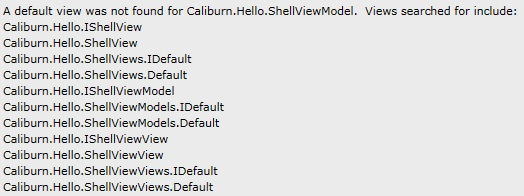
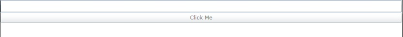

# Basic Configuration, Actions and Conventions

Open Visual Studio and create a new Silverlight 4 Application called “Caliburn.Hello”. You don’t need a web site or test project. Add a reference to Caliburn.Core.dll and Caliburn.PresentationFramework.dll. Delete “MainPage.xaml” and clean up your “App.xaml.cs” so that it looks like this:

```
namespace Caliburn.Hello
{
    using System.Windows;

    public partial class App : Application
    {
        public App()
        {
            InitializeComponent();
        }
    }
}

```

Since Caliburn prefers a View-Model-First approach, let’s start there. Create your first VM and call it ShellViewModel. Use the following code for the implementation:

```
namespace Caliburn.Hello
{
    using System.Windows;
    using PresentationFramework;

    public class ShellViewModel : PropertyChangedBase
    {
        string name;

        public string Name
        {
            get { return name; }
            set
            {
                name = value;
                NotifyOfPropertyChange(() => Name);
                NotifyOfPropertyChange(() => CanSayHello);
            }
        }

        public bool CanSayHello
        {
            get { return !string.IsNullOrWhiteSpace(Name); }
        }

        public void SayHello()
        {
            MessageBox.Show(string.Format("Hello {0}!", Name)); //Don't do this in real life :)
        }
    }
}

```

Notice that the ShellViewModel inherits from PropertyChangedBase. This is a base class that implements the infrastructure for property change notification and automatically performs UI thread marshalling. It will come in handy :)

Now that we have our VM, let’s create the bootstrapper that will configure the framework and tell it what to do. Create a new class named HelloBootstrapper. You can use this tiny bit of code:

```
namespace Caliburn.Hello
{
    using PresentationFramework.ApplicationModel;

    public class HelloBootstrapper : Bootstrapper<ShellViewModel> {}
}

```

There are two Bootsrappers available in Caliburn. This version allows you to specify the type of “root view model” via the generic type. The “root view mdoel” is a VM that Caliburn will instantiate and use to show your application. Next, we need to place the HelloBootstrapper somewhere where it will be run at startup. To do that, change your App.xaml to match this:

_Silverlight_

```
<Application xmlns="http://schemas.microsoft.com/winfx/2006/xaml/presentation"
             xmlns:x="http://schemas.microsoft.com/winfx/2006/xaml"
             xmlns:Hello="clr-namespace:Caliburn.Hello"
             x:Class="Caliburn.Hello.App">
	<Application.Resources>
        <Hello:HelloBootstrapper x:Key="bootstrapper" />
    </Application.Resources>
</Application>

```

_WPF_

```
<Application xmlns="http://schemas.microsoft.com/winfx/2006/xaml/presentation"
             xmlns:x="http://schemas.microsoft.com/winfx/2006/xaml"
             xmlns:local="clr-namespace:Caliburn.Hello"
             x:Class="Caliburn.Hello.App">
    <Application.Resources>
        <ResourceDictionary>
            <ResourceDictionary.MergedDictionaries>
                <ResourceDictionary>
                    <local:HelloBootstrapper x:Key="bootstrapper" />
                </ResourceDictionary>
            </ResourceDictionary.MergedDictionaries>
        </ResourceDictionary>
    </Application.Resources>
</Application>

```

All we have to do is place a Caliburn bootstrapper in the Application.Resources and it will do the rest of the work. Now, run the application. You should see something like this:



Caliburn creates the ShellViewModel, but doesn’t know how to render it. So, let’s create a view. Create a new Silverlight User Control named ShellView. Use the following xaml:

```
<UserControl x:Class="Caliburn.Hello.ShellView"
             xmlns="http://schemas.microsoft.com/winfx/2006/xaml/presentation"
             xmlns:x="http://schemas.microsoft.com/winfx/2006/xaml">
    <StackPanel>
        <TextBox x:Name="Name" />
        <Button x:Name="SayHello"
                Content="Click Me" />
    </StackPanel>
</UserControl>

```

Run the application again. You should now see the UI:



Typing something in the TextBox will enable the Button and clicking it will show a message:


Caliburn uses various naming convention to locate Views for ViewModels. You can see the list of names searched in the first screen shot above. Essentially, the most basic and preferred convention takes the FullName and removes “Model” from it. So, given MyApp.ViewModels.MyViewModel, it would look for MyApp.Views.MyView. Looking at the View and ViewModel side-by-side, you can see that the TextBox with x:Name=”Name” is bound to the “Name” property on the VM. You can also see that the Button with x:Name=”SayHello” is bound to the method with the same name on the VM. The “CanSayHello” property is guarding access to the “SayHello” action by disabling the Button. These are the basics of Caliburn’s ActionMessage and Conventions functionality. There’s much more to show. But, next time I want to show how we can integrate an IoC container such as MEF.

## Referenced Samples

*   [Caliburn.Hello](https://github.com/CaliburnFx/Caliburn/tree/master/samples/Caliburn.Hello)