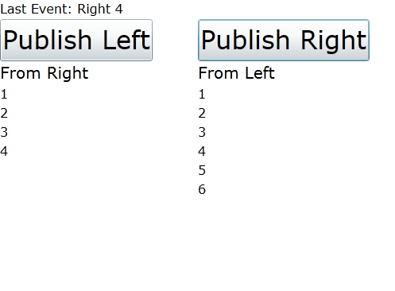

# The Event Aggregator

In Caliburn we have a series of supporting services for building presentation tiers. Among them is the EventAggregator, a service which supports in-process publish/subscribe. There are various implementations of this pattern available in other frameworks, but I think you’ll find that Caliburn's implementation sports the cleanest API and the richest set of features. Let’s start by having a look at the IEventAggregator interface:

```
public interface IEventAggregator {  
    void Subscribe(object instance);  
    void Unsubscribe(object instance);  
    void Publish(object message, Action<System.Action> marshal = null);  
}

```

Below we’ll dig into how the default implementation of this interface (EventAggregator) works.

### Subscribe

With the Caliburn EventAggregator we don’t actually leverage events under the covers. Events are prone to memory leaks and it’s extremely difficult to avoid them or to write a flawless weak event implementation. Instead, we allow you to subscribe an object instance. Under the covers we hold a weak reference. That makes things quite simple. But, how do we know what messages to subscribe to and what methods to use as callbacks? Well, we follow a declarative model by requiring subscribers to implement an interface which states which message they are interested in and provides the callback method. The interface looks like this:

```
public interface IHandle<TMessage> : IHandle {  
    void Handle(TMessage message);  
}

```

And it’s used like this:

```
public class MyViewModel : IHandle<SomeMessage>{  
    public void Handle(SomeMessage message){  
        //do something with the message 
    }  
}

```

Because we use an interface, you can implement IHandle<T> as many times as you want on a given class. This approach keeps things declarative, strongly-typed and free from memory leaks. You can even use explicit interface implementations to hide the handlers if you desire.

### Unsubscribe

There’s not too much to say about this. When you call this method, we search our list of subscribers and remove the specified instance. You may be wondering why this is even necessary if subscribers are held with weak references to begin with. It turns out that there are a number of cases where you want to control the subscription’s activation. Imagine you have a Screen Collection and only the Active Screen is supposed to receive events. In this case, you’d want to subscribe when the screen was activated and unsubscribe when it was deactivated.

### Publish

As you might expect, calling Publish actually sends a message to all it’s subscribers. Here’s how you might use it:

```
public class MyOtherViewModel{  
    IEventAggregator events;  

    public MyOtherViewModel(IEventAggregator events){  
        this.events = events;  
    }  

    public void DoSomething(){  
        events.Publish(new SomeMessage{  
            SomeNumber = 5,  
            SomeString = "Blah..."  
        });  
    }  
}

```

Here, we get an instance of the IEventAggregator service via constructor injection. Then, when the DoSomething method is invoked, we publish the SomeMessage message along with its data. Assuming MyViewMododel above had subscribed itself to the aggregator, it would then have it's Handle method called with the SomeMessage instance. So how does this work? We do this by iterating our list of subscribers to see if any of them implement IHandle<T> where T is assignable from the message that is being published. All the matches that are found then have their handlers called on the UI thread.

### Marker Interface

IHandle<T> inherits from a marker interface IHandle. This allows the use of casting to determine if an object instance subscribes to any events. This enables simple auto-subscribing if you integrate with an IoC container. Most IoC containers provide a hook for being called when a new instance is created. Simply wire for your container’s callback, inspect the instance being created to see if it implement IHandle, and if it does, call Subscribe on the event aggregator. Just remember, you probably don’t want to use this technique if you need conditional subscription as I described above.

### Custom Publication Marshaling

By default messages will be automatically published synchronously on the UI thread. However, this is not always desirable. The optional "marshal" parameter allows you to provide an action which marshals the publication to a custom thread. By using this extension point, a developer could easily write extension methods such as: PublishOnCurrentThread, PublishOnBackgroundThread or PublishOnUIThreadAsync.

### Polymorphic Event Subscriptions

Above I stated that during publication we check for handlers “where T is assignable from the message being published.” We do this with reflection rather than casting in order to enable polymorphic event subscriptions. Let me explain what this means by providing an example:

```
public interface ICustomerMessage{  
    //implementation here 
}  

public interface ICustomerCreated : ICustomerMessage{  
    //implementation here 
}  

public interface ICustomerDeleted : ICustomerMessage{  
    //implementation here 
}  

public class AnUnrelatedMessage{  
    //implementation here 
}  

public class MyObserver :  
    IHandle<object>,   
    IHandle<ICustomerMessage>,   
    IHandle<ICustomerDeleted> {  

    public void Handle(object message){  
        //will handle every message in the application 
    }  

    public void Handle(ICustomerMessage message){  
        //handles ICustomerCreated and ICustomerDeleted 
    }  

    public void Handle(ICustomerDeleted message){  
        //handles only ICustomerDeleted 
    }  
}

```

This turns out to be very powerful, especially when you need to evolve a system over time.

You can see the EventAggregator in action and step through some code by opening up the HelloEventAggregator sample under source. This sample creates a ShellViewModel with two child view models. Each child publishes a message that the other child is subscribed to. The ShellViewModel is subscribed to all messages via the polymorphic features of the aggregator. Here’s a screen shot after some messages have been published:



## Referenced Samples

*   [Caliburn.EventAggregation](https://github.com/CaliburnFx/Caliburn/tree/master/samples/Caliburn.EventAggregation)